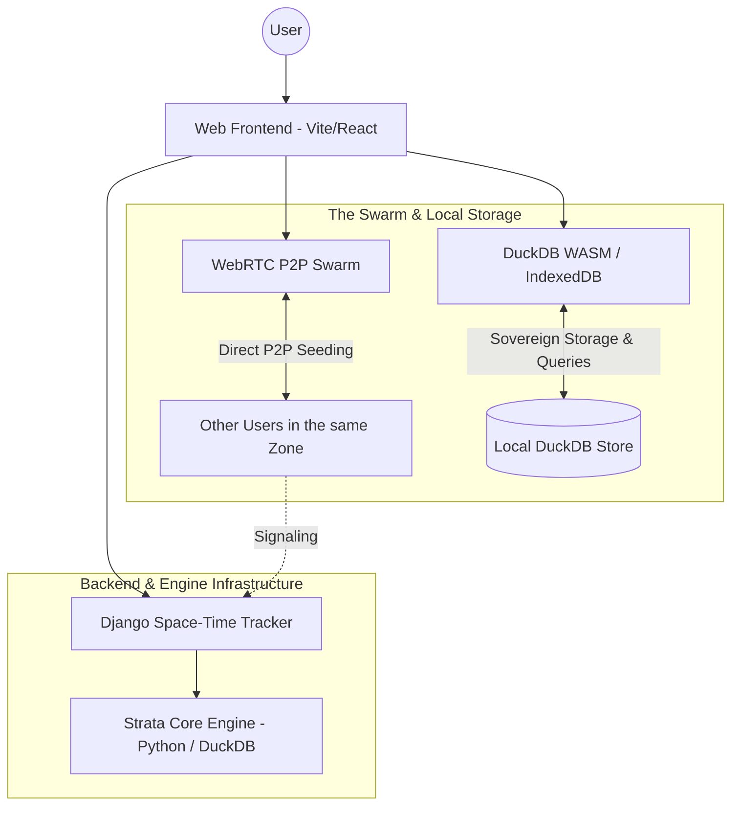

# Handshake: Space-Time Conexions

## The Vision
**Handshake** is a decentralized, space-time anchored communication network where the central focus is **the message, not user profiles or accounts**. 

Rather than managing abstract digital identities or infinite algorithm-driven feeds, Handshake proposes a landscape of **digital graffitis anchored in exact coordinates and time**. Physical encounter validates human relationships, but the virtual network's core unit of value and memory is the space-time trace itself—seeded, preserved, and explored collectively through peer-to-peer swarms.

## The "Handshake" Mechanic
The core organizing principle of trust and custody is the **Handshake**—a cryptographic validation of trust and presence.

Everyone can explore the messages left in the world, but **prominence, priority seeding, and storage custody** are governed by Handshakes:
1. **Local by Default:** A new graffiti is strictly local, discovered when exploring its exact space-time coordinates.
2. **Prominence & Storage Immunity:** Messages left by trusted contacts (or manually pinned) receive visual priority and are granted immunity against automatic local storage metabolism purges.
3. **Your Trust Network:** Messages created by your trusted contacts (exchanged via physical QR Handshake) are prioritized during P2P seeding and highlighted across your viewport.

## Architecture: The Web MVP

We are building a Web-first MVP that leverages browser technologies for a decentralized experience.

### Key Components
1. **Django (The Space-Time Tracker):** Django does not act as a centralized database for all messages. Instead, it acts as a BitTorrent Tracker. When you navigate to a coordinate on themap, Django connects you with other users (peers) exploring the same area.
2. **Web Frontend (Vite/React + WebRTC):** Provides a rich, premium interface to navigate space and a time-slider to explore the past. Once Django connects you to peers, your browser downloads and seeds the graffitis directly from them via WebRTC.
3. **DuckDB (Embedded Storage Engine):** Serves as the embedded OLAP database engine both in browser (`@duckdb/duckdb-wasm` over IndexedDB) and backend/CLI (`duckdb` in Python). It powers fast spatial-temporal queries, recursive thread reconstruction, and local storage metabolism.
4. **Strata (The Agnostic Engine):** The pure-Python core logic (`src/strata`). It handles validation, Ed25519 cryptographic identity, canonical JSON signing, and protocol data structures independent of the transport layer.

## Roadmap

### Hito 1 & 2 (Foundations)
- [x] Physical Persistence & Archaeological Scan logic.
- [x] Unified Engine concept & Ed25519 Cryptographic Identity.
- [x] Identity Manager (`.key` export/import) & core Handshake Protocol logic.

### Hito 3: The Web Pivot (Completado)
- [x] **Django Tracker:** Implement the signaling server for spatial-temporal peer discovery.
- [x] **Web MVP UI:** Build the map and time-slider interface.
- [x] **WebRTC Integration:** Implement browser-to-browser graffiti seeding.
- [x] **Visibility Mechanics & DuckDB Storage:** Integrate open public access with visual prominence, DuckDB embedded engine, and priority seeding for trusted peers.
- [x] **No-Login & Sovereign Storage:** Allow selecting local folders / browser storage for seeding graffitis live, using portable identities via `.key` file export/import.

### Hito 4: Hilos de Conversación Espacial & Multimedia (En Progreso)
- [x] **Graffiti Connections (Spatial Threads):** Connect graffitis via `parent_signature`, enabling recursive discussion trees that trace physical and temporal paths across the map.
- [ ] **Multimedia Graffitis:** Add support for attaching multimedia content (audio, video, images) with SHA-256 integrity verification (`content.attachments`).

