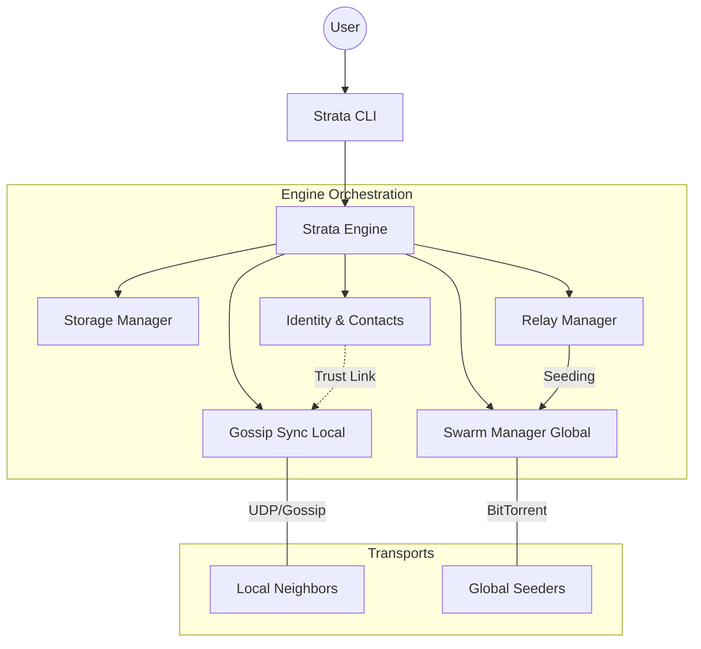

# Handshake

This is an exploration: a way to think about keeping humans physically
connected in a world where virtual interactions are becoming indistinguishable
from reality. Instead of trying to prove who is human, the idea is 
**simpler—create systems where being physically present still matters**.

Users **validate each other through real-world encounters** (e.g., Bluetooth), 
establishing a minimal layer of trust. Once that validation happens, they can 
continue interacting online. The goal is not to guarantee identity, but to 
**anchor digital relationships in physical presence**.

This system favors **local, small-scale connections** over global reach. 
There are no feeds or algorithms deciding what you see. Geography and 
connections become the organizing principle. **Messages live in networks** of
people who have met, and they **propagate through those connections, similar
to how data spreads in peer-to-peer systems**.

You can send **messages to people, to places, or to ideas. Where do ideas live? 
In the geographies where people talk**.

---

# Strata: Geographic P2P Swarms

Strata is the persistence engine of Handshake, allowing humans to leave permanent digital traces in physical locations. It treats the history of a place as a digital palimpsest: layers of messages (strata) that accumulate over time and whose survival depends on collective interest (seeding).

## Current Architecture (Hito 1 - Refined)

### Key Concepts
- **Agnostic Engine:** The core logic is platform-independent. `StrataEngine` is a pure-logic component that can be embedded in CLI tools, mobile apps, or desktop clients.
- **Unified Transport:** It transparently manages both local Gossip and global BitTorrent swarms.
- **Transparent Sync:** The system automatically uses proximity for real-time interaction and swarms for historical persistence.
- **Bridge Discovery:** Peers found on BitTorrent are automatically bridged to the Gossip network.

## How to use

Ensure you have [uv](https://github.com/astral-sh/uv) installed, then run the commands directly with `uv run strata <command>`.

### Commands

- **`node`**: Starts a P2P node for a specific location.
  - Usage: `uv run strata node --lat 40.41 --lon -3.70`
  - Purpose: Syncs messages for that location and acts as a relay for your distant boards.

- **`write`**: Leaves a message on the board at your current location.
  - Usage: `uv run strata write "Hello world" --lat 40.41 --lon -3.70`
  - Purpose: Signs and broadcasts your message to the local swarm.

- **`read`**: Reads messages from the swarm at your current location.
  - Usage: `uv run strata read --lat 40.41 --lon -3.70`
  - Purpose: Pulls history and displays messages, resolving author aliases if known.

- **`handshake`**: Initiates a cryptographic handshake with peers.
  - Usage: `uv run strata handshake`
  - Purpose: Broadcasts your signed identity so others can add you as a trusted contact.

- **`contact`**: Manage your trusted contacts.
  - `add <pk> <alias>`: Saves a peer's public key as a trusted contact.
  - `list`: Displays your current trust graph.

- **`relay`**: Manage your persistent Social Relays.
  - `add <geohash>`: Start persistently seeding a distant board.
  - `list`: View the boards you are currently relaying.
  - `remove <info_hash>`: Stop seeding a specific board.

## Next Steps

### Hito 1 (Completed)
- [x] **Physical Persistence:** Automatically save .msg files to the torrent folder on write.
- [x] **Archaeological Scan:** Implement read to scan and verify signatures of local messages.
- [x] **Metabolism:** Simple TTL or storage limit for the local cache.
- [x] **Unified Engine:** Gossip + BitTorrent transport abstraction.

### Hito 2: Social Layer
- [x] **Identity Manager:** Persistent Ed25519 keys and Contact Book.
- [x] **Handshake Protocol:** Direct peer-to-peer key exchange.
- [x] **Social Relays:** Listen to distant boards via trusted contacts.

### Hito 3: Physical Presence
- [x] **Design:** Presence Protocol with BLE-HAL and RSSI proximity filtering.
- [x] **BLE Integration:** Implement `PresenceManager` and BLE beacon broadcasting.
- [ ] **Proximity UI:** Mobile implementation for discovery and handshake confirmation.
