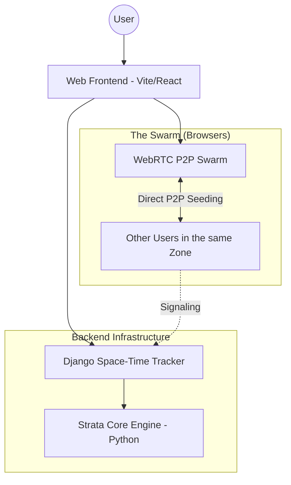

# Handshake: Space-Time Graffitis

## The Vision
**Handshake** is an exploration of keeping humans physically and temporally connected in a digital world. Instead of infinite scrolling feeds decided by algorithms, Handshake proposes a network of **digital graffitis anchored in exact physical coordinates and time**.

Users leave messages in specific locations. To discover them, you must explore those coordinates (either physically or virtually through the space-time map). The system is built on a peer-to-peer (P2P) BitTorrent-like architecture, where users "seed" the graffitis they encounter, keeping them alive in the network.

## The "Handshake" Mechanic
The core organizing principle of visibility is the **Handshake**—a cryptographic validation of trust and presence.

Everyone can see the messages left in the world, but **visibility distance and prominence** are dictated by Handshakes:
1. **Local by Default:** A new graffiti is strictly local. You can only see it if your viewport (or physical GPS) is very close to its exact space-time coordinates.
2. **The Handshake Multiplier (Social Proof):** If a message accumulates many Handshakes (validations from users who encounter it), its visibility radius expands. It becomes a beacon that can be seen from much further away.
3. **Your Trust Network:** Messages left by people you have personally "Handshaked" with (your trusted contacts) will always be highlighted and visible to you from a much greater distance. 

## Architecture: The Web MVP

We are building a Web-first MVP that leverages browser technologies for a decentralized experience.

### Key Components
1. **Django (The Space-Time Tracker):** Django does not act as a centralized database for all messages. Instead, it acts as a BitTorrent Tracker. When you navigate to a coordinate on the map, Django connects you with other users (peers) exploring the same area.
2. **Web Frontend (Vite/React + WebRTC):** Provides a rich, premium interface to navigate space and a time-slider to explore the past. Once Django connects you to peers, your browser downloads and seeds the graffitis directly from them via WebRTC.
3. **Strata (The Agnostic Engine):** The pure-Python core logic (`src/strata`). It handles the validation, cryptographic rules, and data structures of the space-time graffitis, remaining independent of the web transport layer.

## Roadmap

### Hito 1 & 2 (Foundations)
- [x] Physical Persistence & Archaeological Scan logic.
- [x] Unified Engine concept.
- [x] Identity Manager & core Handshake Protocol logic.

### Hito 3: The Web Pivot (Current)
- [ ] **Django Tracker:** Implement the signaling server for spatial-temporal peer discovery.
- [ ] **Web MVP UI:** Build the map and time-slider interface.
- [ ] **WebRTC Integration:** Implement browser-to-browser graffiti seeding.
- [ ] **Visibility Mechanics:** Integrate the "Handshake multiplier" logic to expand the visibility radius of validated messages.
- [ ] **No-Login & Local Seeding:** Permitir seleccionar una carpeta local desde la web para seedear graffitis en vivo (File System API), utilizando identidades portables mediante la exportación/importación de un archivo `.key`.

### Hito 4: Hilos de Conversación Espacial (Next)
- [ ] **Graffiti Connections:** Encontrar la manera de conectar graffitis (hilos de conversación/threads), permitiendo seguir un hilo de discusión entre distintos graffitis localizados en diferentes partes de la red.

