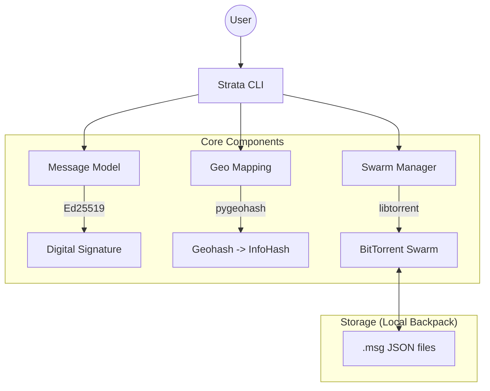

# Handshake: Strata

**Strata** is the persistence engine of Handshake, allowing humans to leave permanent digital traces in physical locations. It treats the history of a place as a **digital palimpsest**: layers of messages (strata) that accumulate over time and whose survival depends on collective interest (seeding).

## 🏗️ Current Architecture (Hito 1)



### Key Concepts
- **Agnostic Engine:** Currently implemented as a Python CLI.
- **Dual Layer:** Supports Public (anonymous) and Anchored (owned) layers.
- **Geographic Swarms:** Every Geohash/Epoch combination is a unique BitTorrent InfoHash.

## 🚀 How to use

1. **Setup:**
   ```bash
   uv sync
   ```

2. **Leave a trace:**
   ```bash
   uv run strata write "Hello from the square!" --lat -34.60 --lon -58.38
   ```

3. **Start a node (Seed):**
   ```bash
   uv run strata node --lat -34.60 --lon -58.38
   ```

## ⏭️ Next Steps

### Hito 1 (Closing)
- [ ] **Physical Persistence:** Automatically save `.msg` files to the torrent folder on `write`.
- [ ] **Archaeological Scan:** Implement `read` to scan and verify signatures of local messages.
- [ ] **Metabolism:** Simple TTL or storage limit for the local cache.

### Hito 2: Social Layer
- [ ] **Handshake Protocol:** Direct peer-to-peer key exchange.
- [ ] **Social Relays:** Listen to distant boards via trusted contacts.

### Hito 3: Physical Presence
- [ ] **Bluetooth PoP:** Certify presence via BLE beacons.
- [ ] **Mobile App:** Native experience with the "Time Dial" UI.
