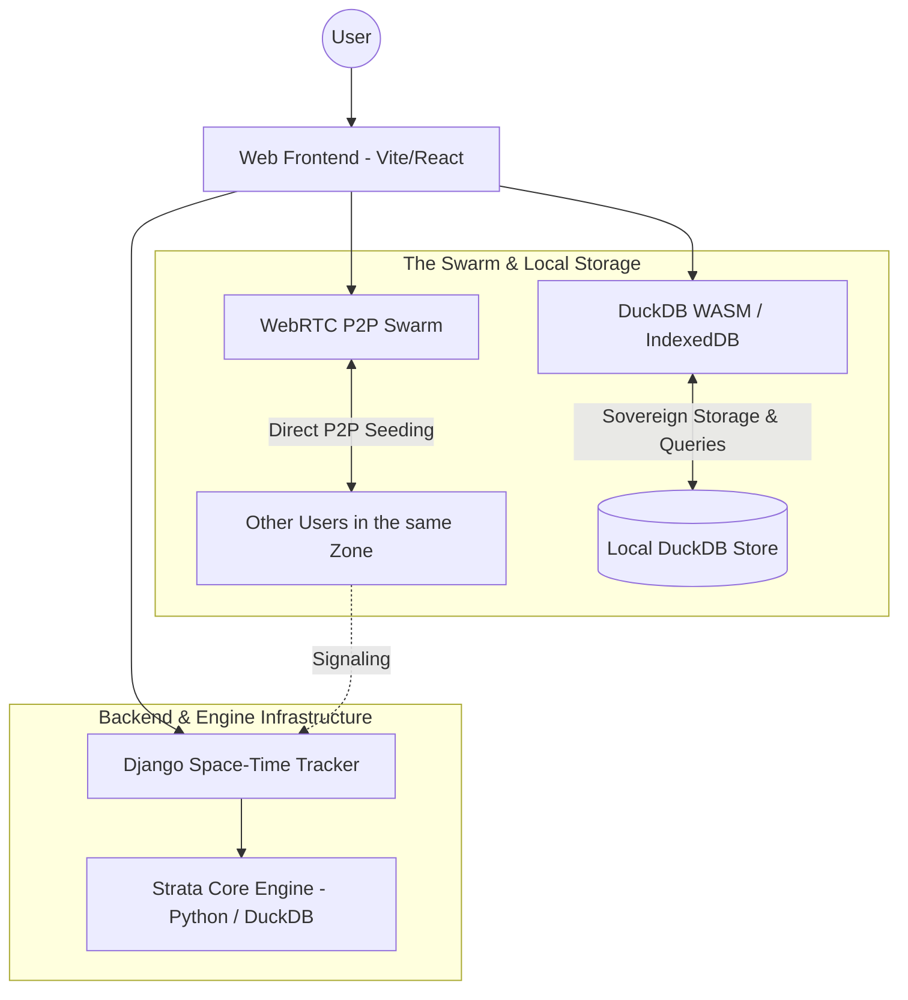

# Handshake: Space-Time Conexions

## The Vision
**Handshake** is a decentralized, space-time anchored communication network where the central focus is **the message, not user profiles or accounts**. 

Rather than managing abstract digital identities or infinite algorithm-driven feeds, Handshake proposes a landscape of **digital graffitis anchored in exact coordinates and time**. Location is never passive surveillance or tracking imposed on the user; it is an **expressive, voluntary, and strictly necessary act**—in Handshake, no message can exist without its space-time anchor. The virtual network's core unit of value and memory is the space-time trace itself—seeded, preserved, and explored collectively through peer-to-peer swarms. While physical proximity or in-person exchanges exist as optional local capabilities, messages live, circulate, and retain value on their own merit across space and time.

## Space-Time Swarms & Collective Custody
The network is organized around peer-to-peer swarms, sovereign local storage, and collective custody:

1. **Local by Default:** Every graffiti is anchored in its exact space-time coordinates, discovered when exploring those coordinates.
2. **Collective Custody (Seed / Unseed):** Users act as custodians of spatial memory. You sovereignly choose which graffitis to seed and preserve in your local DuckDB, and which to leave to automatic storage metabolism.
3. **P2P Handshakes:** When nodes explore the same space-time zone, they establish direct peer-to-peer connections (WebRTC data handshakes over `strata-sync`) to discover and synchronize messages without servers.
4. **Trusted Contacts & Storage Immunity:** Users can optionally exchange cryptographic identities (via QR or BLE handshakes) to build local contact books, granting their messages visual prominence and immunity from storage purges.

## Architecture: The Web MVP

We are building a Web-first MVP that leverages browser technologies for a decentralized experience.

```mermaid
graph TD
    User((User)) --> WebApp[Web Frontend - Vite/React]
    WebApp --> DuckDBWasm[DuckDB WASM / IndexedDB]
    WebApp --> WebRTC[WebRTC P2P Swarm]
    WebApp --> Tracker[Django Space-Time Tracker]
    
    subgraph "The Swarm & Local Storage"
        WebRTC <-->|Direct P2P Seeding| OtherPeers[Other Users in the same Zone]
        DuckDBWasm <-->|Sovereign Storage & Queries| LocalDB[(Local DuckDB Store)]
    end
    
    subgraph "Backend & Engine Infrastructure"
        Tracker --> Engine[Strata Core Engine - Python / DuckDB]
    end
    
    OtherPeers -.->|Signaling| Tracker
```

### Key Components
1. **Django (The Space-Time Tracker):** Django does not act as a centralized database for all messages. Instead, it acts as a BitTorrent Tracker. When you navigate to a coordinate on themap, Django connects you with other users (peers) exploring the same area.
2. **Web Frontend (Vite/React + WebRTC):** Provides a rich, premium interface to navigate space and a time-slider to explore the past. Once Django connects you to peers, your browser downloads and seeds the graffitis directly from them via WebRTC.
3. **DuckDB (Embedded Storage Engine):** Serves as the embedded OLAP database engine both in browser (`@duckdb/duckdb-wasm` over IndexedDB) and backend/CLI (`duckdb` in Python). It powers fast spatial-temporal queries, recursive thread reconstruction, and local storage metabolism.
4. **Strata (The Agnostic Engine):** The pure-Python core logic (`src/strata`). It handles validation, Ed25519 cryptographic identity, canonical JSON signing, and protocol data structures independent of the transport layer.

## Documentation

- [Architectural Invariants](docs/architecture-invariants.md): Foundational invariants for identity, space-time anchoring, topology, storage, and P2P sync.
- [Protocol Specification](docs/protocol.md): Full technical specification covering message schemas, signaling, and data synchronization.
